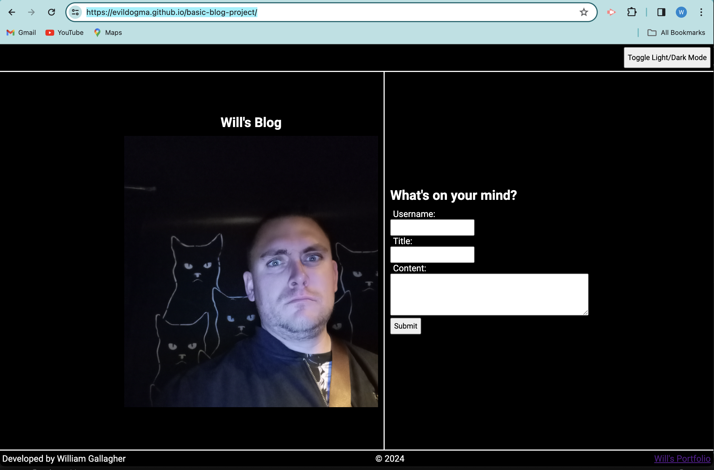
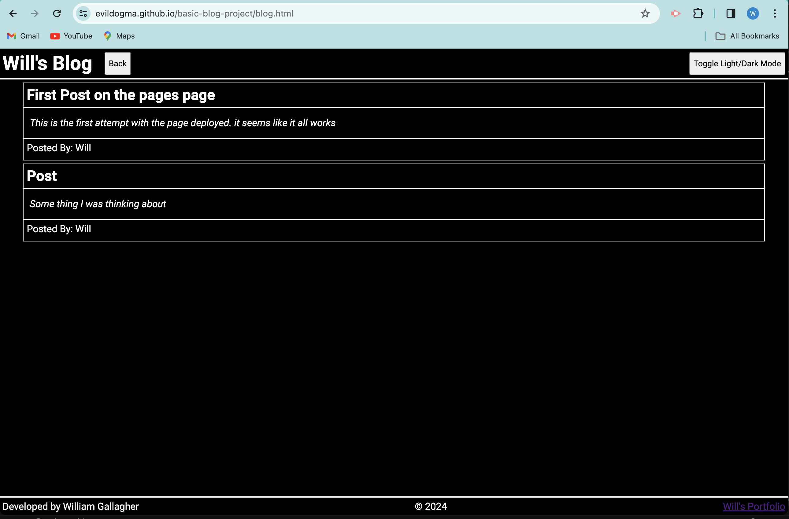
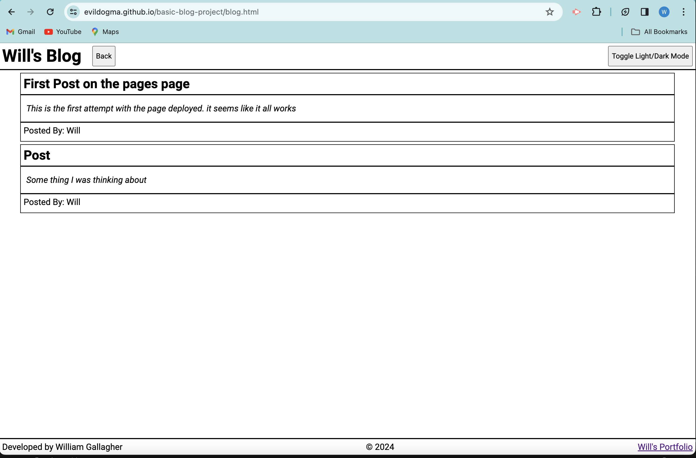

# Basic Blog Project
A basic blog made for Rutgers coding boot camp Module 04

## Author: William  Gallagher

## Description

This basic blog has functionality based on the user acceptance criteria provided. It takes it takes blog post inputs from a form on one page and renders them on another page. Thes posts are saved in browser local storage and will persist if you leave the page. Basic light/dark mode functionality was also added. This project is especially useful for learning about the DOM, local storage, and Javascript.

## Visuals

### Landing Page/Entry Form

###  Blog Page

### Light Mode

## Deployment

Provided as a link here - [Will's Blog](https://evildogma.github.io/basic-blog-project/)

## Usage

To use the webpage, you can enter data into the form and click submit. It will bring your to a Page which will display your inputs as a blog post. Click the back button at the top of the page to return to the form and add more posts. When you submit, all posts will be visible on the blog page. you can click the Light/Dark Mode button to switch between light and dark mode. When you switch pages your light/dark perference will persist. If you inspect the page and check the developer tools, you can look at the application tab. You will see two items stored in local Storage. A one called 'posts' and one caleed 'mode'. This your information which renders your posts to the page and saves them and your color preference.

## Credits

- Xpert learner and Chat GPT for help with the CSS. 
- Google for many other questions.

## License

MIT License. Please read the document in the repo.